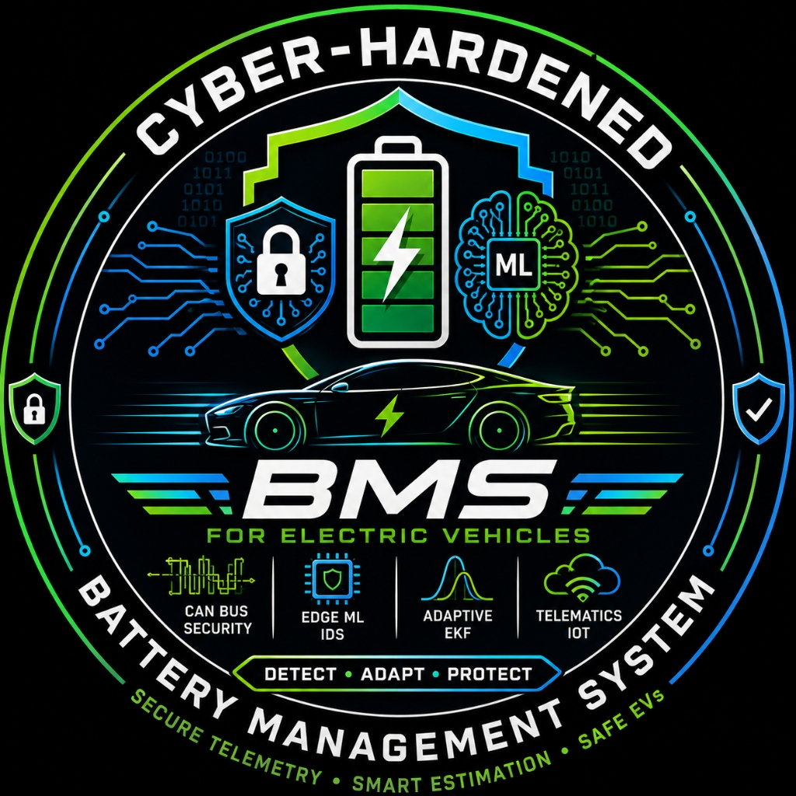
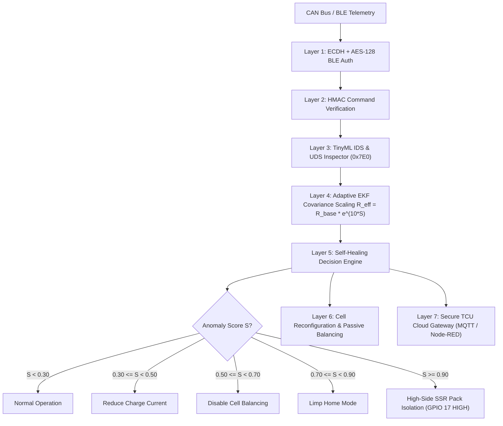

<p align="center">
  
</p>

<h1 align="center">Cyber-Hardened Battery Management System (BMS) for EVs</h1>

<p align="center">
  <a href="LICENSE"></a>
  <a href="https://www.espressif.com/en/products/socs/esp32"></a>
  <a href="#7-layer-security-architecture"></a>
  <a href="#tinyml--algorithmic-innovation"></a>
</p>

An open-source, production-grade **Self-Healing Cyber-Hardened Battery Management System** designed for Electric Vehicle (EV) 2-wheeler and 3-wheeler applications. The system protects unauthenticated CAN and Bluetooth (BLE) buses against Denial of Service (DoS) floods, false data injection (spoofing), replay attacks, and UDS (ISO 14229) session hijacks.

It introduces a novel **Trust-Scaled Extended Kalman Filter (EKF)** that dynamically couples an on-device machine learning anomaly score $S \in [0, 1]$ to scale the measurement covariance matrix $R_{\text{eff}} = R_{\text{base}} \cdot e^{\lambda \cdot S}$. Under cyber-attack ($S \to 1$), the Kalman gain approaches zero ($K \to 0$), suppressing corrupted sensor data without controller collapse.

---

## Key Highlights & Novelty

* **Zero-GPU Embedded Execution:** Compiled via `m2cgen` into C++ decision tree `if-else` blocks running in `<0.35 ms` latency on ESP32 Core 0 ($38.4\text{ KB}$ SRAM footprint).
* **Dual-Core FreeRTOS Isolation:** Core 0 handles ML anomaly classification, BLE auth, and UDS inspection; Core 1 executes deterministic AFE polling, EKF state estimation, cell balancing, and high-side SSR cutoff control.
* **Automated High-Side SSR Cutoff:** Automated physical pack disconnect triggered on GPIO 17 within $<1.2\text{ ms}$ during emergency severe attacks ($S > 0.90$).
* **Layer 3 UDS (ISO 14229) Protection:** Intercepts unauthorized `SecurityAccess` (`0x27`) seed requests and `TesterPresent` (`0x3E`) keep-alives over OBD-II/CAN IDs `0x7E0`/`0x7E8`.
* **Cost-Optimized BOM:** Reduced total setup cost to **₹2,100 – ₹2,400 (~$28–$32 USD)** per prototype benchmark setup.

---

## 7-Layer Security Architecture



---

## Repository Structure

```
├── assets/                   # Repository logo & visual media assets
│   └── logo.png
├── bms_master/               # ESP32 Master Firmware (FreeRTOS Core 0/1, EKF, IDS, SSR driver)
│   ├── bms_master.ino
│   └── ids_model.h           # Compiled m2cgen C++ decision tree weights
├── attacker_node/            # ESP32 Attack Injector (Modes 1-7: DoS, Spoof, Replay, Fuzz, UDS, SSR Test)
│   └── attacker_node.ino
├── tcu_node/                 # Telematics Control Unit MQTT bridge
│   └── tcu_node.ino
├── docs/                     # Full GitHub Documentation Suite (Wiki, API, Wiring, Flowcharts, Build Guide)
│   ├── WIKI.md
│   ├── API_DOCUMENTATION.md
│   ├── FLOWCHARTS.md
│   ├── WIRING_DIAGRAMS.md
│   └── BUILD_GUIDE.md
├── simulations/              # MATLAB, KiCad, SPICE & Proteus simulation suite
│   ├── matlab/               # .m scripts & generated PNG plot waveforms
│   └── kicad/ ltspice/ ...   # Hardware schematics & spice files
├── generate_dataset.py       # Live CAN telemetry & feature extraction script
├── train_ids.py              # Random Forest training & C++ code export
└── run_all_simulations.py    # Master python simulation & visualization runner
```

---

## Documentation Quick Links

* 📖 **[Project Wiki](docs/WIKI.md)** — In-depth theory, EKF math derivation, 4S vs 16S pack architecture, and secure boot setup.
* 🔌 **[API Documentation](docs/API_DOCUMENTATION.md)** — CAN message IDs (`0x180`, `0x7E0`), UDS diagnostic services, BLE UUIDs, and firmware APIs.
* 📊 **[Flowcharts & Diagrams](docs/FLOWCHARTS.md)** — Interactive Mermaid diagrams for FreeRTOS tasks, EKF trust scaling, and self-healing.
* ⚡ **[Wiring Diagrams](docs/WIRING_DIAGRAMS.md)** — Pinout reference, High-Side SSR cutoff schematics, and BQ76920 AFE connections.
* 🛠️ **[Build & Setup Guide](docs/BUILD_GUIDE.md)** — Step-by-step assembly, low-cost BOM purchasing table, code compilation, and HIL testing.

---

## Low-Cost Bill of Materials (Target ₹2,100 – ₹2,400)

| Component Category | Baseline Choice | Low-Cost Optimized Choice | Savings | Optimized Price |
| :--- | :--- | :--- | :--- | :--- |
| **Microcontrollers** | 3x ESP32 Dev Boards (₹1,140) | 1x ESP32-S3 / 2x Bare ICs + Laptop SLCAN | ₹380 – ₹450 | **₹690** |
| **CAN Transceivers** | 3x SN65HVD230 Modules (₹360) | 2x VP230 / TJA1051 Standalone DIP/SOP ICs | ₹120 | **₹240** |
| **Battery Pack** | 16x New 18650 Cells (₹1,050) | 4S1P Reclaimed High-Drain 18650 Pack | ₹600 | **₹450** |
| **Displays** | 0.96" SSD1306 OLED (₹90) | Stream to Node-RED / Grafana / Serial | ₹90 | **₹0** |
| **AFE & Sensors** | BQ76920 Breakout Board | BQ76920 IC + Shunt Resistor | ₹0 | **₹800** |
| **High-Side SSR Cutoff** | Standard Relay (₹120) | High-Side SSR / Optocoupler P-FET Switch | ₹30 | **₹90** |
| **Total Setup** | **₹3,600 – ₹4,750** | **Target Prototype Bench Setup** | **₹1,220 – ₹1,290** | **₹2,100 – ₹2,400** |

---

## Quick Start

### 1. Run Simulations
```bash
python run_all_simulations.py
```
Outputs simulation plots into `simulations/matlab/`:
* `sim_7layer_results.png`
* `sim_ekf_adaptive_results.png`
* `sim_ids_classifier_results.png` (6-class confusion matrix)

### 2. Flashing Master Firmware
Open `bms_master/bms_master.ino` in Arduino IDE 2.x with ESP32 Board Package 3.x, select `ESP32 Dev Module`, and upload to Master ESP32.

---

## License

Distributed under the **MIT License**. See `LICENSE` for details.
