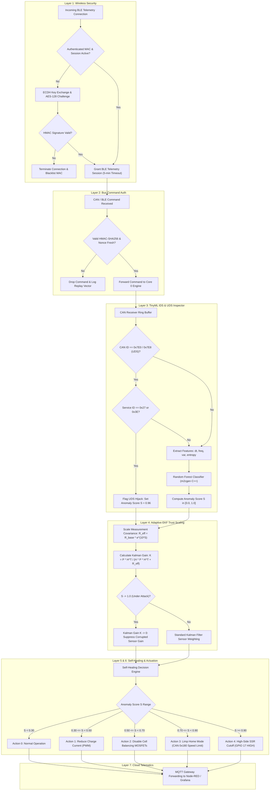
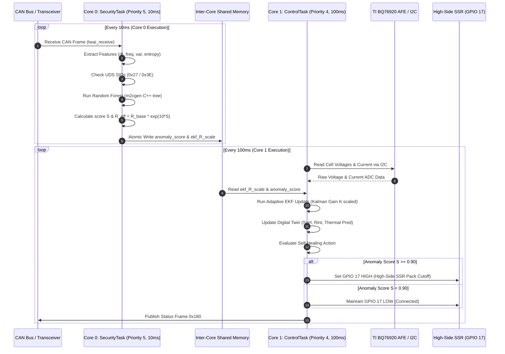
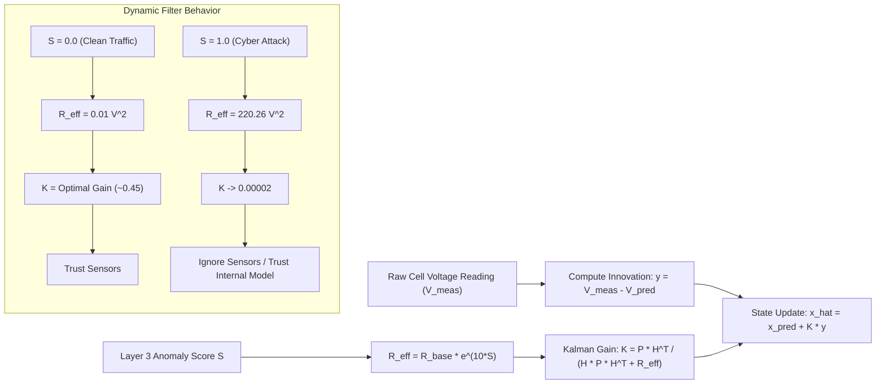
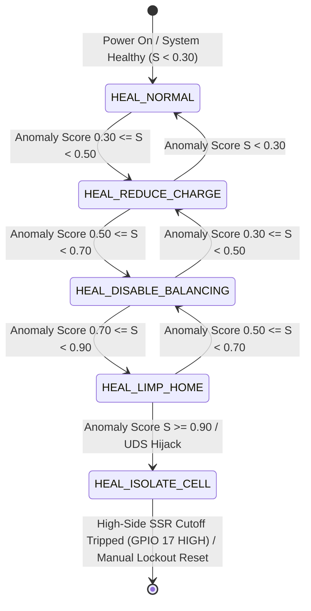
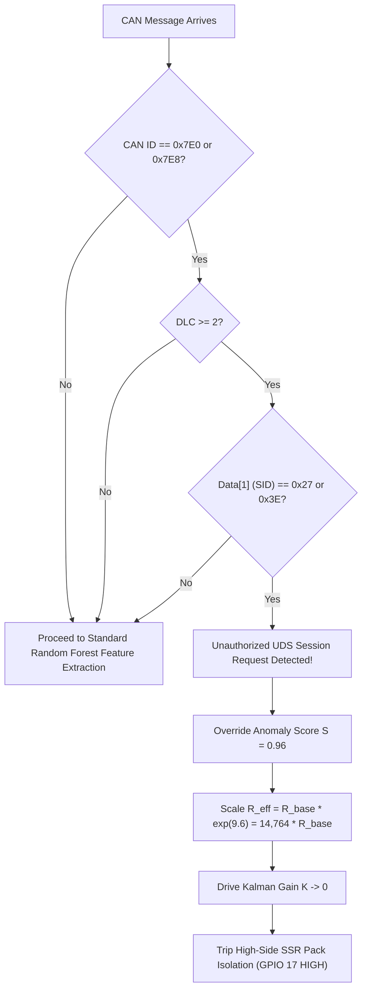

# Cyber-Hardened BMS — Flowcharts & Diagrams

This document presents all system flowcharts, FreeRTOS task sequence diagrams, state machines, and mathematical control graphs in interactive GitHub-flavored Mermaid notation.

---

## 1. Complete 7-Layer Security Flowchart

---

## 2. FreeRTOS Dual-Core Execution Diagram

---

## 3. EKF Covariance Scaling & Gain Suppression Flow

---

## 4. Self-Healing State Machine Transitions

---

## 5. UDS Session Hijack Inspection Flow

