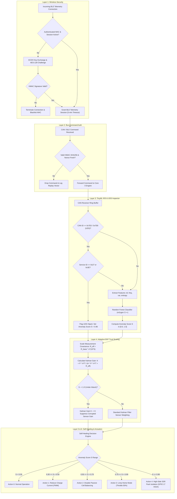
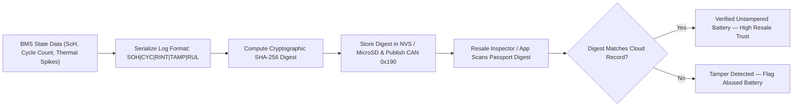
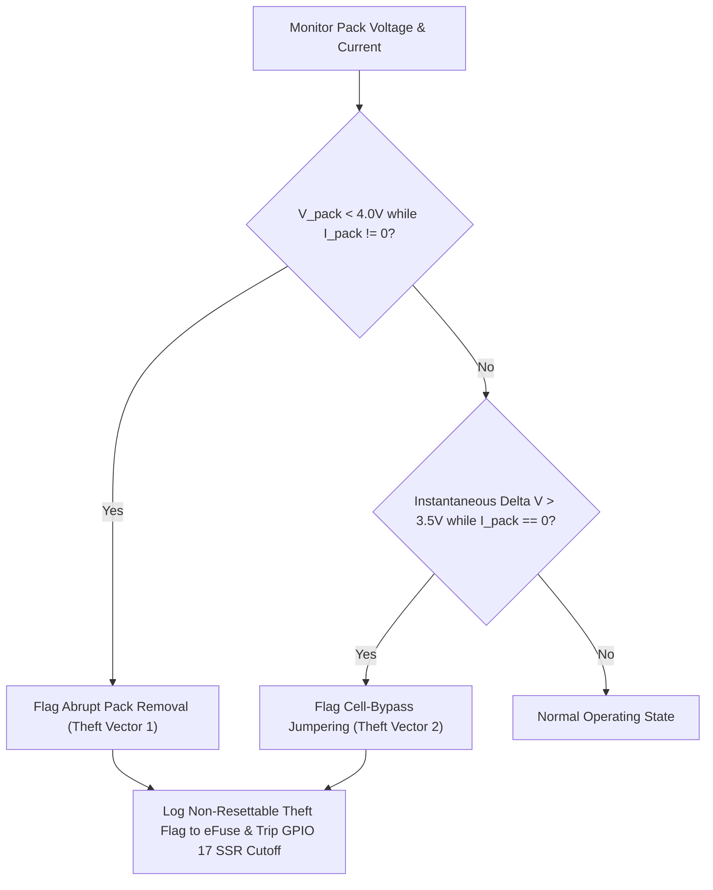
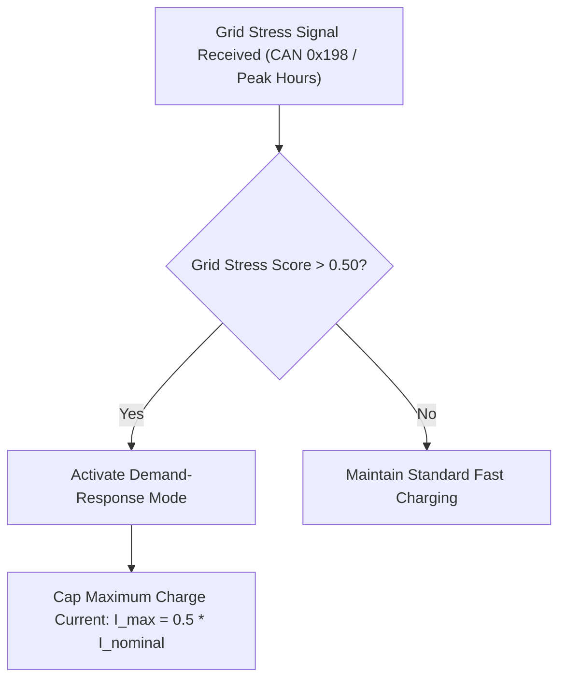
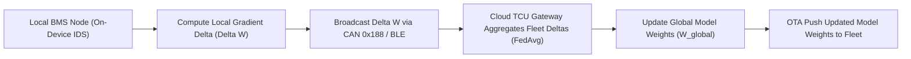

# Cyber-Hardened BMS — Flowcharts & Diagrams

This document presents all system flowcharts, FreeRTOS task sequence diagrams, state machines, and mathematical control graphs in interactive GitHub-flavored Mermaid notation.

---

## 1. Complete 7-Layer Security Flowchart

---

## 2. Advanced Features Flowcharts

### Digital Battery Health Passport Flowchart

### Battery Theft & Physical Cell-Bypass Tamper Detection

### Grid-Aware Demand-Response Charging

### Federated Learning Fleet Intelligence Update Cycle

