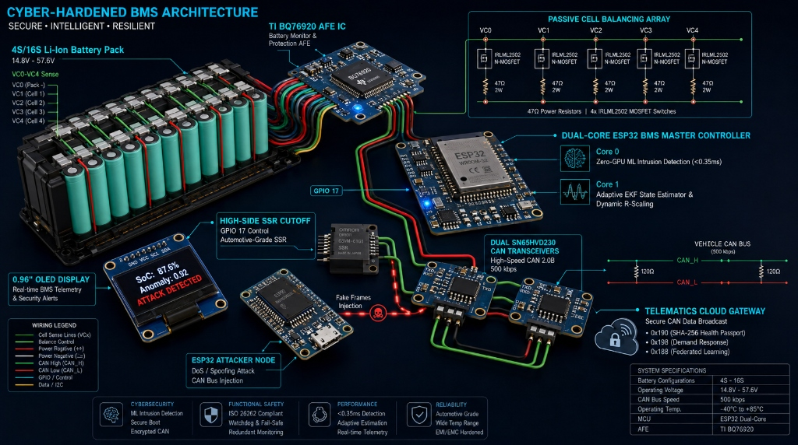
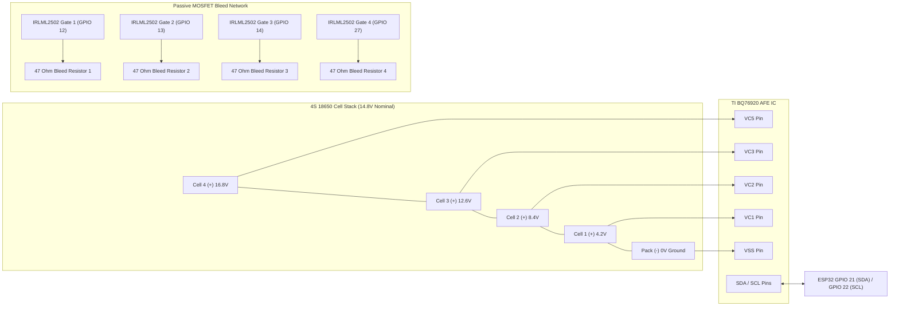

# Cyber-Hardened BMS — Wiring Diagrams & Pinout Specifications

This document contains complete pinout reference tables, ASCII schematics, and Mermaid circuit diagrams for hardware assembly.

---

## 3D Hardware Blueprint & Cyber-Hardened Architecture

<p align="center">
  
</p>

---

## 1. Master Hardware Pinout Reference Table

### ESP32 Master Node (`bms_master.ino`) Pinout

| ESP32 Pin | Signal Name | Connected Hardware Component | Interface / Notes |
| :--- | :--- | :--- | :--- |
| **GPIO 5** | `CAN_TX` | SN65HVD230 CAN Transceiver Pin 1 (TXD) | TWAI Built-in CAN Controller TX |
| **GPIO 4** | `CAN_RX` | SN65HVD230 CAN Transceiver Pin 4 (RXD) | TWAI Built-in CAN Controller RX |
| **GPIO 17** | `SSR_CUTOFF` | Optocoupler Input $\to$ P-FET / High-Side SSR Gate Driver | **Output HIGH = Pack Isolation Cutoff Trip** |
| **GPIO 21** | `I2C_SDA` | BQ76920 SDA (Pin 20) + SSD1306 OLED SDA | Hardware I2C 0 (Requires $4.7\text{ k}\Omega$ pullups to 3.3V) |
| **GPIO 22** | `I2C_SCL` | BQ76920 SCL (Pin 19) + SSD1306 OLED SCL | Hardware I2C 0 (Requires $4.7\text{ k}\Omega$ pullups to 3.3V) |
| **GPIO 35** | `ALERT_INT` | BQ76920 ALERT Interrupt (Pin 14) | Input-only, Active HIGH / Falling Edge Interrupt |
| **GPIO 18** | `SPI_CLK` | MicroSD Card Module CLK Pin | Hardware SPI Bus |
| **GPIO 19** | `SPI_MISO` | MicroSD Card Module MISO Pin | Hardware SPI Bus |
| **GPIO 23** | `SPI_MOSI` | MicroSD Card Module MOSI Pin | Hardware SPI Bus |
| **GPIO 5** | `SD_CS` | MicroSD Card Module CS Pin | Hardware SPI Chip Select |
| **GPIO 12** | `BAL_GATE1` | Cell 1 Balancing IRLML2502 MOSFET Gate | $100\,\Omega$ Gate Resistor (Passive Bleed) |
| **GPIO 13** | `BAL_GATE2` | Cell 2 Balancing IRLML2502 MOSFET Gate | $100\,\Omega$ Gate Resistor (Passive Bleed) |
| **GPIO 14** | `BAL_GATE3` | Cell 3 Balancing IRLML2502 MOSFET Gate | $100\,\Omega$ Gate Resistor (Passive Bleed) |
| **GPIO 27** | `BAL_GATE4` | Cell 4 Balancing IRLML2502 MOSFET Gate | $100\,\Omega$ Gate Resistor (Passive Bleed) |
| **VIN (5V)** | `POWER_5V` | USB 5V or Buck Regulator Output | System Main Power Supply |
| **GND** | `SYSTEM_GND` | Common Ground Bus | Common Signal & Power Ground |

---

### ESP32 Attacker Node (`attacker_node.ino`) Pinout

| ESP32 Pin | Signal Name | Connected Component | Notes |
| :--- | :--- | :--- | :--- |
| **GPIO 5** | `CAN_TX` | SN65HVD230 Transceiver #2 Pin 1 (TXD) | CAN Injection Output |
| **GPIO 4** | `CAN_RX` | SN65HVD230 Transceiver #2 Pin 4 (RXD) | CAN RX |
| **VIN / GND** | 5V / GND | USB Power Bus | Common Power & Ground |

---

## 2. High-Side Solid-State Relay (SSR) Cutoff Schematic

```
                          HIGH-SIDE PACK CUTOFF CIRCUIT
                          
   ESP32 GPIO 17 ──[ 220Ω ]──┐
                             │
                            ┌┴┐ (Optocoupler LED)
                            │V│ PC817 Optocoupler
                            └┬┘
   SYSTEM GND ───────────────┴──────────────────────────────┐
                                                            │
   BATTERY PACK (+) ──┬──[ 10kΩ ]──┬── Gate (G)             │
  (16.8V Max / 4S)   │            │                        │
                     │           ┌┴┐ (Opto Transistor)      │
                     │           │/│                        │
                     │           └┬┘                        │
                     │            └─────────────────────────┘
                     │
                    ┌┴┐
                    │ │ Source (S)
                    └┬┘ IRF4905 / High-Side P-FET (or SSR)
                     │ Drain (D)
                     │
                     └───[ High-Side Power Line to Load / Motor Controller ]
```

* **Normal State (GPIO 17 LOW):** Optocoupler OFF $\to$ P-FET Gate pulled up to Pack (+) $\to$ P-FET ON ($V_{GS} = 0\text{V}$, load connected).
* **Cutoff Trip State (GPIO 17 HIGH):** Optocoupler ON $\to$ P-FET Gate pulled down to GND $\to$ P-FET OFF ($V_{GS} < -10\text{V}$, load disconnected $<1.2\text{ ms}$).

---

## 3. BQ76920 AFE Cell Voltage Sensing & Passive Balancing Circuit



---

## 4. CAN Bus Split Termination Circuit Schematics

```
    SN65HVD230 CAN Transceiver                 Isolated Dual-Wire CAN Bus
   ┌──────────────────────────┐
   │                          │
   │  CANH (Pin 7) ───────────┴───────┬─────────────[ CANH Line ]
   │                                  │
   │                                [ 60Ω ]
   │                                  │
   │                                  ├───[ 4.7nF Cap ]─── GND
   │                                  │
   │                                [ 60Ω ]
   │                                  │
   │  CANL (Pin 6) ───────────┬───────┴─────────────[ CANL Line ]
   │                          │
   └──────────────────────────┘
```

* **Split Termination:** $60\,\Omega + 60\,\Omega = 120\,\Omega$ effective differential termination.
* **Common-Mode Noise Filtering:** $4.7\text{ nF}$ ceramic capacitor connected from center node to GND reduces high-frequency EMI noise on unshielded EV wiring harnesses.
